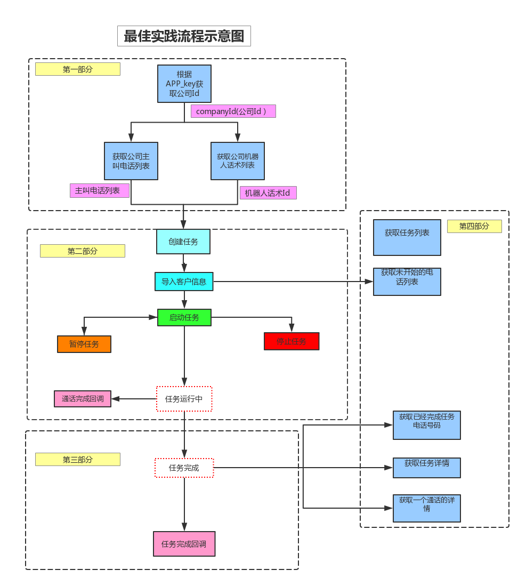

# 介绍
百应机器人API文档

这是百应机器人API文档，具体详情查看每个API接口调用说明；

如果有问题，欢迎联系我们客服，技术支持

公司官网地址 ：[www.byai.com/](https://www.byai.com/)
 

# 开发引导

## 调用说明

调用方式说明：

第一种方式：主动调用
  这种调用方式是客户主动调用接口获取数据或实现功能；
  
  主动调用需要传入APP_KEY和APP_SECRET用于权限校验；
  
  注意：请在开发对接程序前联系百应技术支持进行注册，如果你还未签约，请先签约开通账户。
  
第二种方式：方法回调
  这种调用方式是当达到预设条件如：任务状态变更或通话结束时，由百应主动向指定地址发送信息；
  
  注意：请在开发前联系百应技术同学配置好回调地址。
  


百应机器人API是使用HTTP并遵循REST风格设计的Web服务接口；

您可以使用几乎任何客户端和任何编程语言与REST API进行交互。

通过发送简单的HTTP请求就可以轻松接入使用。

调用方式分为两种：主动调用和方法回调。

## 认证    

> 认证密钥样例

```java
  APP_KEY = "WtSMaXXXXXXXXtvy";
  APP_SECRET = "aXSFnnZbHXXXXXXXXXXXXXXXMguz1Q";    
```

API认证采用HMACSha1加密算法进行加密，使用GMT时间戳、APP_KEY、APP_SECRET共同生成一个密钥。

目前已有完整JAVA版的demo，具体实现请下载DEMO查阅。
Python版demo目前包含签名算法和获取公司列表接口demo可供查阅。
Php版demo目前包含签名算法和get,post请求样例可供查阅。

> 请在API样例`byrobot-openapi-demo`中替换为自己的APP_Key和APP_SECRET.

百应为确保您的账户和信息安全，请在开发对接程序前联系百应技术支持注册接口调用专属密钥。

<aside class="notice">
您必须替换对接密钥 <code>APP_KEY 和 APP_SECRET </code>在您的对接程序中 
</aside>

## 统一请求格式

URL格式：

<code>/{resource}/{function}</code>

说明： 

{resource}为资源名，通常对应一类API

{function}为该资源提供的操作方法

请求响应的结果为json格式

>比如查询公司列表的url为：
  
```请求URL样例  
<code>http://openapi/v1/company </code> 表示调用company（公司列表）的get方法，并且返回json格式的字符串。

我们目前已经提供的接口，请参考API。 

```

HTTP头信息:

<code>Accept:application/json;charset=utf-8</code>

说明：

请求方式(Method)：统一用POST方式
编码：UTF-8

## AppKey和回调地址


说明：使用CRM超级管理员账号登录，在系统管理->系统设置->API配置中可获得AppKey，AppSecret。
创建AppKey的账号才具有修改回调地址的权限。
CRM账号获取方法请联系相关客服。

>

## DEMO 下载

本页面提供Java,Python,Php的Demo下载。

SDK包内有部分使用说明，各接口的详细使用说明请浏览各API详情页。

如百应未提供您使用语言的SDK，您可以根据API文档开发接口

语言 | GitHub地址 
--------- | ------- 
JAVA | [GitHub地址](https://github.com/indata-public/byrobot-openapi-demo) 
Python|[GitHub地址](https://github.com/indata-public/byrobot-openapi-python-demo)
PHP  | [GitHub地址](https://github.com/indata-public/byrobot-openapi-php-demo)

##最佳实践流程图:

 
 
 
##常见问题解答
1. 定时任务和手动任务的异同
- A: 
-   异：
    定时任务在设定好启动时间和结束时间时会在到达指定时间时自动启动
    手动任务则需要导入客户之后手动启动任务
    同：
    任务到达12-14点或指定暂停时间会自动暂停，并且会占用AI并发量
    
2. isv账号能否操作多个crm账号下的任务
- A：一个appKey和appSecret可以通过api接口操作多个crm账号，获取公司信息和任务信息，需要提供您的子公司的公司名
给百应的api负责同学，百应这边为您绑定之后就可以通过openApi操作子公司下的任务了


 
##流程说明

###第一部分:

主要是获取公司相关信息，为创建任务提供数据。

这里一共三个接口分别查询到：
1.公司Id

2.公司的主叫电话号码列表

3.机器人话术相关参数：
  
  1）机器人话术id
  
  2) 机器人话术场景id
  
  3) 机器人话术录音id

###第二部分:

核心业务部分，主要是任务的创建，启动，停止等操作。

####1.创建任务

    创建任务过程中需要传入的几个重要的值：场景id,场景录音id,机器人话术id,这三个值不能传入有误，传入出错会导致任务拨打有误
####2.任务启动和暂停
    任务创建完成之后，调用启动任务接口就可以启动任务，任务在启动时，可调用暂停任务让任务进入暂停状态（可再次运行）
####3.停止任务  
    在任务进行中，每一次通话结束都会调用通话回调接口，将本次通话详情发送到指定回调地址。

###第三部分:

任务运行结束，调用任务回调接口，将本次任务信息发送到指定回调地址。

###第四部分:

主要是查询任务相关信息。
 
##枚举类型说明

### 主叫号码类型枚举
 
code    | desc 
--------- | ------- 
0 | 手机 
1 | 阿里云固话 
2 | 无主叫固话
6 | SIP线路

### 任务类型枚举
 
code    | desc 
--------- | ------- 
1 | 定时启动任务
2 | 手动启动任务 


### 外呼类型枚举
 
code    | desc 
--------- | ------- 
0| sim卡(默认)
1| 固话
2| 无主叫 

### 任务状态枚举
 
code    | desc 
--------- | ------- 
0| 未开始
1| 进行中
2| 已完成
3| 可运行
4| 用户暂停
5| 系统暂停
6| 已终止
7| 排队中
8| AI到期
9| 线路欠费
10| 短信欠费

### 任务实例状态枚举
 
code    | desc 
--------- | ------- 
0| 未开始
1| 进行中
2| 已完成
3| 二次拨打调度中


### 通话实例已完成状态枚举(finishStatus)
code   | desc
----|-----
0| 已接听
1| 拒接
2| 无法接通
3| 主叫号码不可用
4| 空号
5| 关机
6| 占线
7| 停机
8| 未接
9| 主叫欠费
10| 呼损
11| 黑名单

### 呼叫类型枚举
code   | desc
----|-----
0|免费试用
1|任务
2|用户单独拨打
3|收费试用
4|Ope后台拨打
5|大屏试用
100|客服人工拨打


## 错误码信息

错误码 | 错误信息
---------- | -------
200|执行成功
401|校验数据错误
404|资源未找到
403|权限不足
412|参数错误
500|未知错误


#最近更新日志
##2018年7月23日
1. 修改任务AI坐席数（任务并发数）
2. 单次电话外呼接口

###更新说明：
7月
- 新增接口如下：
1. 开放对外呼任务的AI坐席数（任务并发数）进行修改的接口支持，可更新任务状态为非进行中任务的AI坐席数（任务并发数）
2. 开放单次电话外呼接口，可以通过该接口进行单次的电话外呼
- 接口改动如下：
1. 获取已经完成任务电话号码接口查询每页不能超过50条

7月28日
- 新增接口如下：
1. 开放通过客户手机号直接进行电话外呼的接口

##2018年11月
11月
- 新增信息获取接口：
1.获取获取任务未开始的电话列表
- 接口改动
1.回调接口增加客户标签数据
##2018年12月13日
- 增加任务修改接口的修改返回

##2018年12月28日
- 手动修改客户意向等级回调接口。说明：针对用户在crm账号下进行客户意向等级修改后进行回调，及时同步客户意向等级信息

## 2019-01-07
- 通话记录回调参数补全

## 2019-02-19
- 新增单个黑名单用户导入到默认分组接口

## 2019-02-19
- 获取公司话术的接口增加条件获取已发布的话术
- 导入任务数据的时候检查用户属性和话术变量的匹配，并返回成功条数，失败条数
- 新增呼入回调文档接口

## 2019-03-20
- 新增回调失败查询接口
- 新增任务导入客户号码接口v2版

## 2019-04-02
- 新增话术变量查询接口
